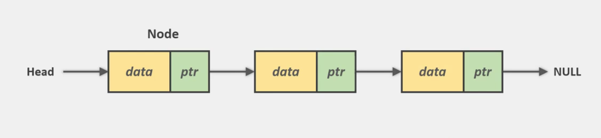

# Linked List 

* Store elements in a sequence just like an array
* Elements are not contiguos
    * stored in nodes 
    * elements can not be accessed throught index
* A node is a container that holds the value and a pointer 
to the next node 
    * forms a chain of nodes 
* The first node is called a head
    * all access is through the head pointer
    * last node points to a null pointer
* Insertions and deletions are faster
    * if you already have the node pointer
* Can have different types 
    * singly 
    * double linked 
    * circular 
    

